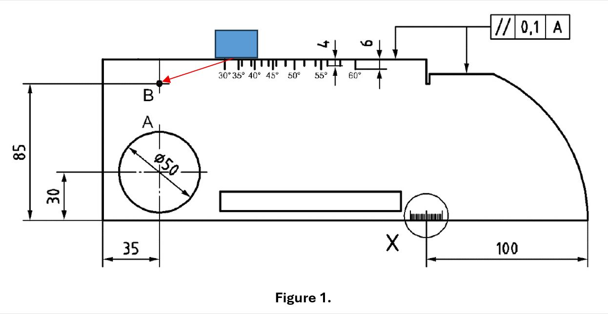
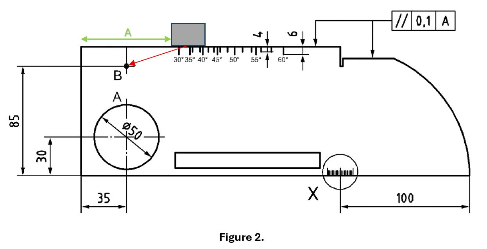
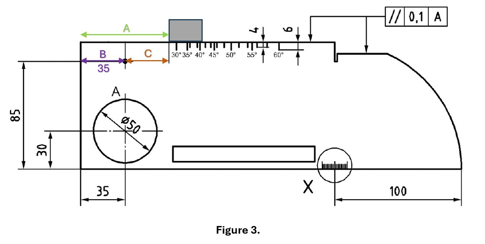
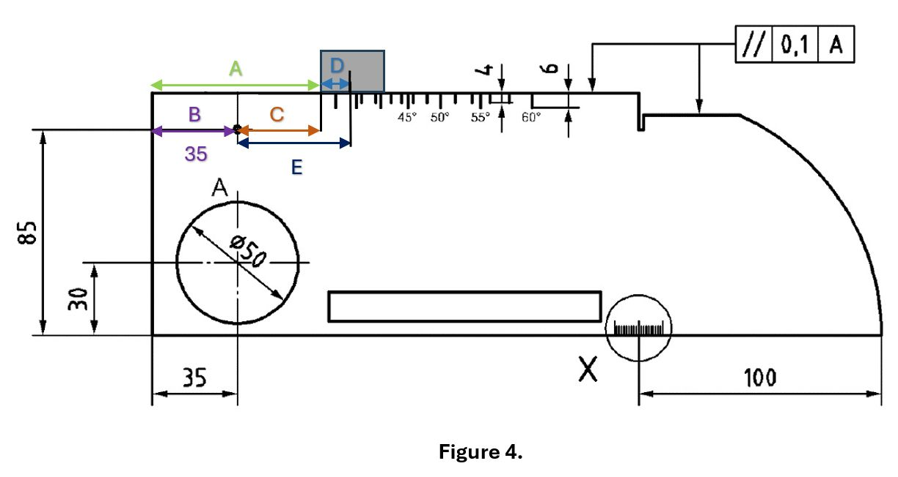
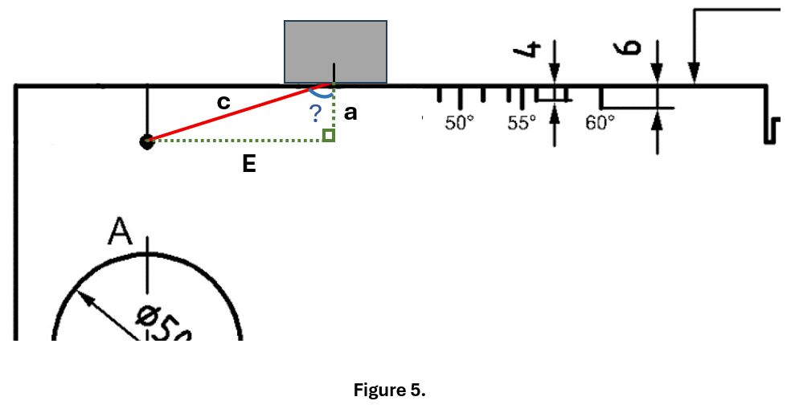

Angle verification is one of the most underestimated steps in UT — yet it defines your accuracy.

One of the key factors determining the accuracy of ultrasonic testing is the verification of the refracted angle in an angle‑beam probe. 
Even a small deviation affects beam path, skip distance, and flaw localization.

Step 1 (Figure 1). Probe positioning

Place the angle‑beam probe on the V1 block in the position shown in Figure 1 and obtain the maximum echo from the side‑drilled hole “B”.

Step 2 (Figure 2). Surface distance measurement

Measure the surface distance from the probe to the block edges.
Let this distance be A.

Step 3 (Figure 3). Geometric correction

Subtract the fixed 35 mm (dimension B according to ISO 2400) from A to obtain C.

Step 4 (Figure 4). Probe index compensation

Add the probe index offset D to C.
The result is E — the effective horizontal projection of the sound path.

Step 5 (Figure 5). Angle calculation

Now we have a right triangle where:
- a = 15 mm (depth of the side‑drilled hole according to ISO 2400).
- E is the horizontal leg.

Using these values, calculate the actual refracted angle:
Angle=arctan⁡(E/a)

Important note: according to ISO 22232‑2, the actual refracted angle of an angle‑beam probe shall be within ±2° of its nominal value. 
If the calculated angle exceeds this tolerance, the probe shall not be used for flaw detection.

Accurate angle verification ensures reliable flaw positioning and consistent UT results.

How do you verify the refracted angle in your daily UT practice?